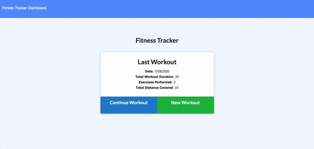

# ExerciseMe

[Live App](https://radiant-hamlet-39822.herokuapp.com/)

Track your workout progress with exerciseMe. This app allows you to continue with your workout, add new exercises to your current workout or create a new workout. The app allows you to check your progress on the app dashboard, where you would have access to different types of graphs with all the information.

# Technologies Used

1. mongoDB with mongoose
2. Node.js
3. Express
4. Javascript
5. HTML, CSS, Bootstrap
6. Morgan

# Table of Contents

* [Installation](#installation)
* [Instructions](#instructions)
* [Example Gif](#example-gif)
* [Author](#author)

## Installation
> 1.npm install

## Instructions
> Open your browser and go to [ExerciseMe](https://radiant-hamlet-39822.herokuapp.com/). From there, click on new workout and start creating your prefered workout.

## Example Gif

## Author 

**MikelTafalla**

Email: mikel362d@gmail.com

Location: Santa Barbara

GitHub: https://github.com/MikelTafalla

